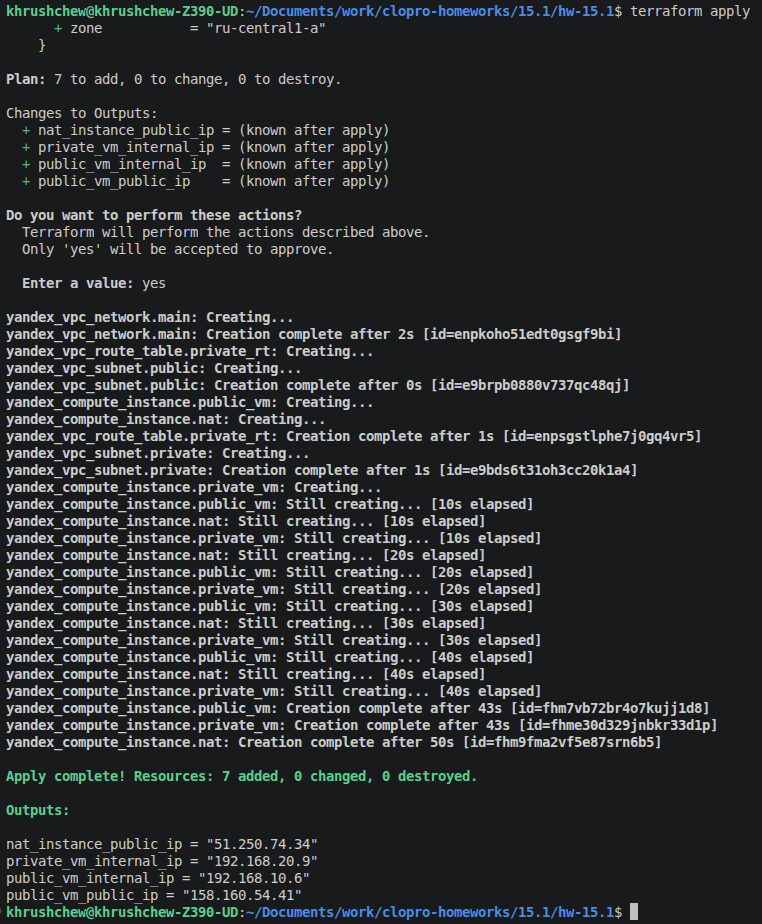
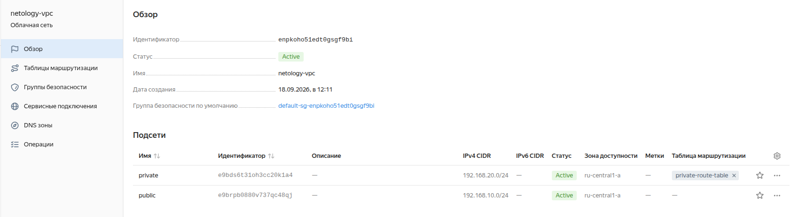
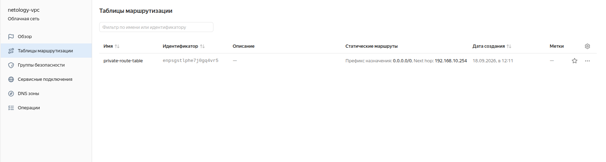
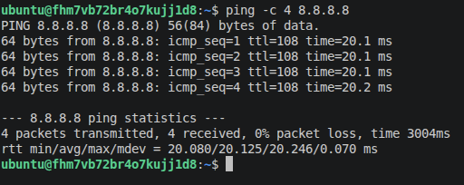
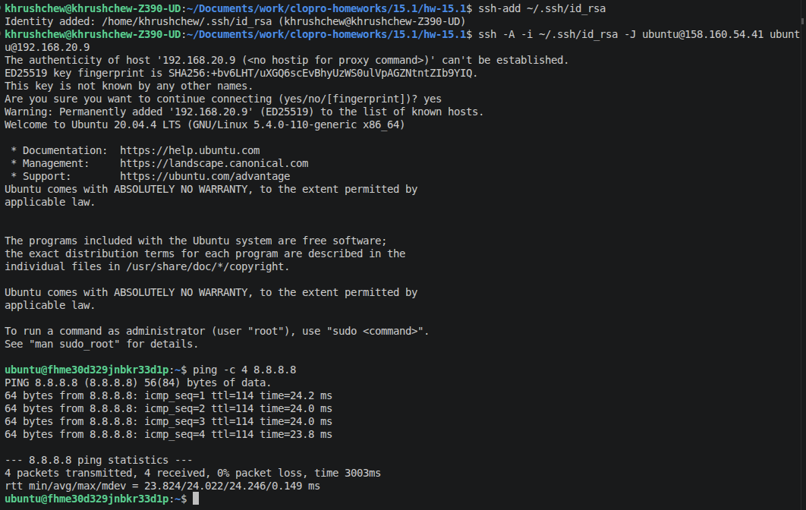

# Домашнее задание 15.1 — Организация сети (Yandex Cloud)

## Задание 1. Yandex Cloud

### Что сделано

1. Создана пустая VPC (`netology-vpc`).  
2. **Публичная подсеть** (`public`, `192.168.10.0/24`):
   - NAT-инстанс с фиксированным IP `192.168.10.254` (image `fd80mrhj8fl2oe87o4e1`).
   - ВМ `public-vm` с публичным IP-адресом.
3. **Приватная подсеть** (`private`, `192.168.20.0/24`):
   - Route table с маршрутом `0.0.0.0/0 → 192.168.10.254` (NAT-инстанс).
   - ВМ `private-vm` без публичного IP — выход в интернет только через NAT.

---

## Terraform-манифесты

| Файл | Описание |
|---|---|
| [`main.tf`](main.tf) | Основная конфигурация: VPC, подсети, route table, ВМ |
| [`variables.tf`](variables.tf) | Переменные |
| [`outputs.tf`](outputs.tf) | Outputs: IP-адреса созданных ресурсов |
| [`terraform.tfvars.example`](terraform.tfvars.example) | Пример файла переменных |

---

## Выполнение

### 1. Инициализация и применение Terraform

```bash
cp terraform.tfvars.example terraform.tfvars

terraform init
terraform plan
terraform apply
```

### 2. Результат `terraform apply` — созданные ресурсы



---

### 3. Ресурсы в консоли Yandex Cloud

#### VPC и подсети



#### Route table приватной подсети



---

### 4. Подключение к public-vm и проверка доступа в интернет

```bash
ssh ubuntu@<public_vm_public_ip>
ping -c 4 8.8.8.8
curl -s https://ifconfig.me
```



---

### 5. Подключение к private-vm через public-vm (jump host) и проверка доступа в интернет

```bash
# С локальной машины:
ssh -J ubuntu@<public_vm_public_ip> ubuntu@<private_vm_internal_ip>

# На private-vm:
ping -c 4 8.8.8.8
curl -s https://ifconfig.me
```


